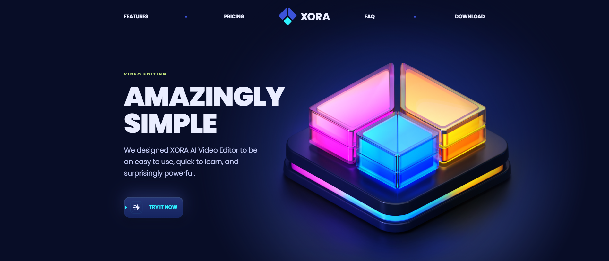

# Xora



Welcome to Xora! This shows the next level of AI Video Editing and easier to learn.

# Link

## Table of Contents
* [Description](#description)
* [Installation](#installation)
* [Usage](#usage)
* [License](#license)
* [Contributing](#contributing)
* [Tests](#tests)
* [Resources](#resources)

## Installation
You will need these npm (Node Package Manager) in order to view Xora. You will navigate to the root of the directory of the package.json file, navigate to "Open in Integrated Terminal" and enter these commands to install the packages:
```
npm install
npm install clsx
npm install react-countup
npm install react-slidedown
npm install react-scroll
```


## Usage
You can use the "Node.js" terminal to check out Xora, and checkout information about what I have to offer.

## License
[](https://opensource.org/licenses/MIT)

## Contributing
All the contributions to this project is all done by Miles Wildmore.


## Tests

To test out Xora, you will need to run the server by typing this in the terminal and open the localhost from the root directory with this command:
```
npm run dev

```

If you want to leave Xora in the terminal, hold "CTRL+C" ("CMD+C" for Mac) to stop hosting localhost.

## Resources

Link to npm page : https://www.npmjs.com/

Link to get node.js: https://nodejs.org/